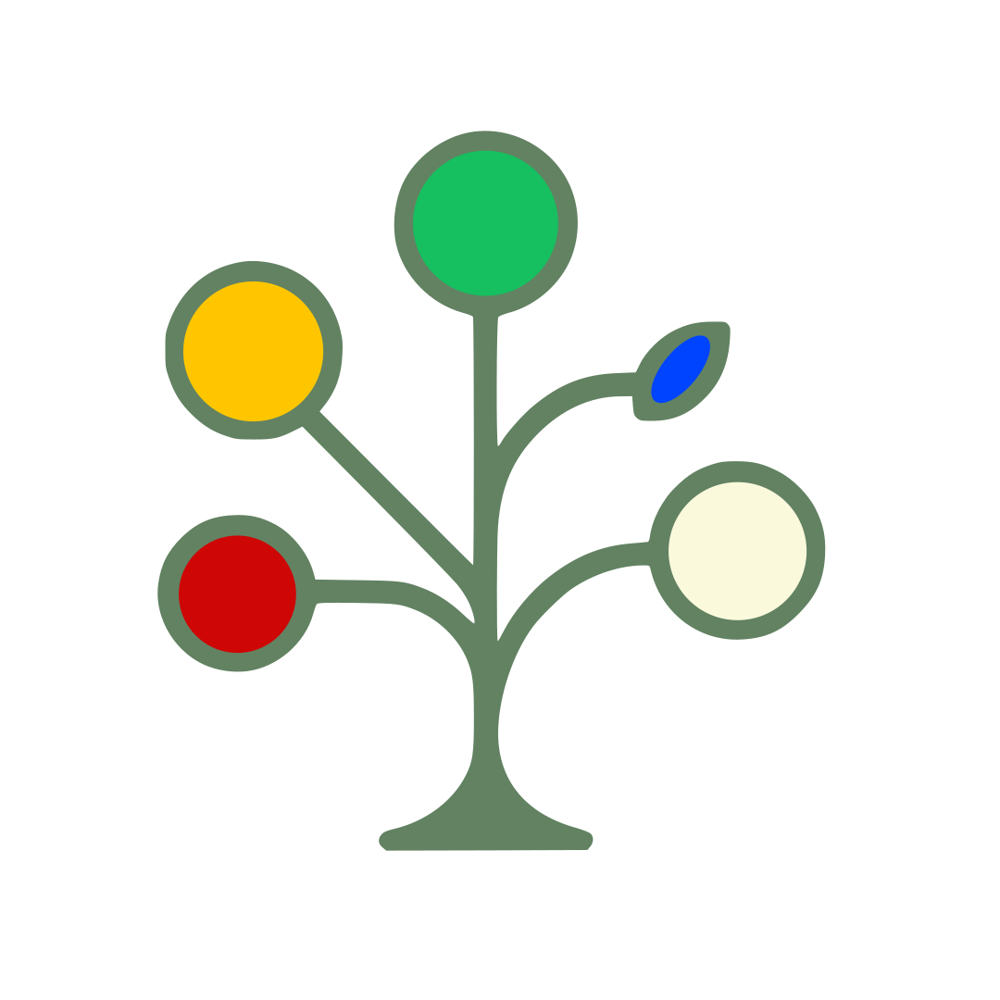

<p align="center">

</p>

Treelab is a Next.js application designed to be a flexible, hierarchical data management tool where users can create and manage data trees with custom-defined templates. Lots of the ideas of this software are taken from the magnific [Treeline](https://github.com/doug-101/TreeLine) desktop software, this web application tries to improve on several aspects by allowing an online workflow from any browser, tree sharing with concurrent editing, versioning with github backend, and a better interface for handling images and attachments into nodes.

<p align="center">

</p>

## ✨ Core Features

-   **🕸️ Hierarchical Data**: Organize data in a nested, tree-like structure with full drag-and-drop support for reordering and reparenting nodes.
-   **🎨 Custom Templates**: Design templates with a rich set of field types (text, date, dropdowns, pictures, tables, attachments, and more) to structure your data nodes. Includes a drag-and-drop interface for reordering fields.
-   **🌲 Multi-Tree Management**: Create, edit, rename, and switch between multiple independent data trees.
-   **🔄 Import/Export**: Export your trees and templates as JSON or ZIP archive for backup or sharing.
-   **🤝 Collaborative Sharing**: Tree can be shared with other users
-   **☁️ GitHub Sync**: Configure a GitHub Personal Access Token and link your trees to public or private repositories for version control, change history, and backup.

## 🚀 Getting Started & Configuration

The recommended setup is to use docker with docker-compose which will run treelab together with a mongodb container. This is an example docker-compose.yml

```yml
services:
    treelab:
        ports:
            - 3000:3000
        image: ghcr.io/asamarco/treelab
        container_name: treelab
        volumes:
            - ./data:/app/data
            - ./config.json:/app/config.json
        restart: unless-stopped
        env_file: .env
        depends_on: 
            - mongo
    
    mongo:
        container_name: mongodb
        image: mongo:8.0
        restart: unless-stopped
        network_mode: swag
        volumes:
           - ./db:/data/db
```

NOTE: The data folder where the attachments will be saved should have read and write permissions for the user 65532 (standard user in distroless docker images).
```chown -D 65532:65532 data/```

### Setup

This application requires some initial setup to connect to its database and define its core behavior.

### Environment Variables (`.env`)

Create a `.env` file in the root of your project. This file is for secret keys and should not be committed to version control.

```
# The connection string for your MongoDB database.
MONGODB_URI="mongodb://..."

# A 32-character secret key used for encrypting sensitive data in the database.
# You can generate one using an online tool or command line (e.g., openssl rand -base64 24).
ENCRYPTION_KEY="your_32_character_secret_encryption_key"
```

### Application Config (`config.json`)

This file controls the application's runtime behavior.

```json
{
  "REQUIRE_AUTHENTICATION": true,
  "USERID": "test"
}
```

-   `REQUIRE_AUTHENTICATION`:
    -   Set to `true` to enable multi-user mode with login/registration. This is the standard mode for production.
    -   Set to `false` to run the app in a single-user "demo" mode. All data will be associated with the `USERID` specified below.
-   `USERID`:
    -   Only used when `REQUIRE_AUTHENTICATION` is `false`. This string will be the user ID for all data created in demo mode.
